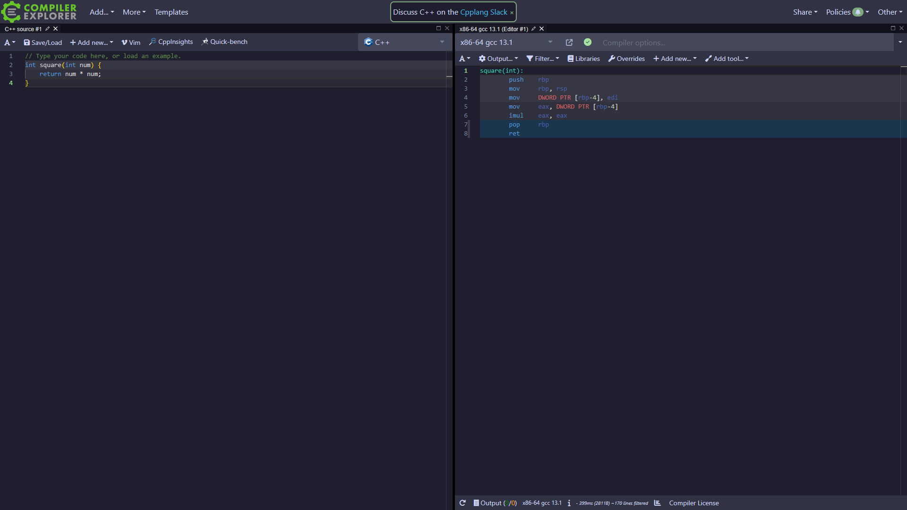

# godbolt-catppuccin
Soothing pastel theme for Godbolt Compiler Explorer.

	

The theme is not finished. Assistance is appreciated.
I do not know CSS, don't judge :)

## Usage

#### Stylus
1. Install Stylus [Firefox](https://addons.mozilla.org/en-GB/firefox/addon/styl-us/)/[Chrome](https://chrome.google.com/webstore/detail/stylus/clngdbkpkpeebahjckkjfobafhncgmne) extension.
2. Enable CSP Patching from Stylus Settings > Advanced.
3. [Click here to install.](https://github.com/Dooez/godbolt-catppuccin/raw/main/catppuccin.user.css)

I was unable to affect minimap, so I suggest disabling it in godbolt settings.
